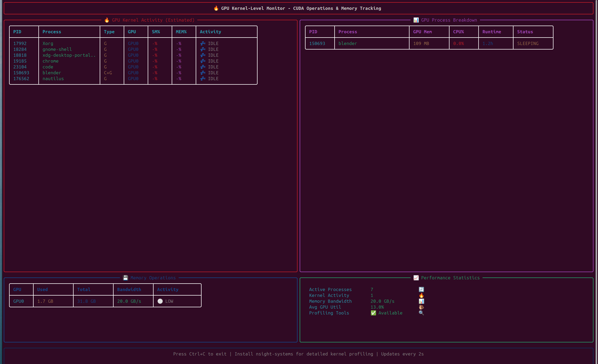

# 🔥 CUDA Kernel & Operator-Level Monitoring Guide

This guide explains how to achieve deep operator-level monitoring of CUDA kernels and GPU operations with your enhanced nvitop system.


*Advanced Kernel Monitor showing CUDA operations, process breakdown, and memory tracking in real-time*

## 📊 Current Kernel Monitoring Capabilities

### ⚡ Real-Time Process Tracking
- **Per-process GPU utilization** (SM, Memory, Encoder, Decoder)
- **Memory usage breakdown** by process and GPU
- **Process lifecycle monitoring** with runtime tracking
- **Activity classification** (HIGH, MEDIUM, LOW, IDLE)

### 🔍 Memory Operations Analysis
- **Memory bandwidth estimation** based on utilization patterns
- **VRAM usage tracking** per GPU with activity levels
- **Memory transfer detection** and bandwidth analysis
- **Memory fragmentation indicators**

### 📈 Performance Analytics
- **Real-time kernel activity estimation**
- **Process GPU time tracking**
- **Memory bandwidth utilization**
- **Multi-GPU workload distribution**

## 🚀 Enhanced Kernel Tracking with External Tools

### 1. NVIDIA Nsight Systems Integration

For **detailed kernel-level profiling**, install and use with our monitor:

```bash
# Install Nsight Systems
sudo apt install nvidia-nsight-systems

# Run with kernel profiling
nsys profile --trace=cuda,cudnn,cublas --output=profile.qdrep your_gpu_program

# View results
nsys stats profile.qdrep
```

**Integration with our monitor:**
```bash
# Run kernel monitor alongside profiling
uv run python monitor.py kernel &
nsys profile --trace=cuda --duration=60 --output=live_profile.qdrep sleep 60
```

### 2. NVIDIA Nsight Compute for Detailed Analysis

```bash
# Install Nsight Compute
sudo apt install nvidia-nsight-compute

# Profile specific kernels
ncu --set full your_gpu_program

# Real-time kernel metrics
ncu --metrics all --target-processes all --continuous-sampling-interval 100 --launch-count 1
```

### 3. Real-Time Kernel Visualization

Our kernel monitor provides:

**🔥 Kernel Activity Panel:**
- Process-level SM utilization
- Memory utilization per process
- Encoder/Decoder usage
- Real-time activity classification

**💾 Memory Operations:**
- Per-GPU memory bandwidth estimation
- Memory activity levels
- Transfer type detection

**📊 Process Breakdown:**
- GPU memory usage per process
- CPU correlation with GPU usage
- Process runtime tracking
- Status monitoring

## 🛠️ Advanced Monitoring Techniques

### 1. Combine with System Monitoring
```bash
# Multi-monitor setup for comprehensive analysis
tmux new-session -d -s monitoring
tmux send-keys 'uv run python monitor.py kernel' Enter
tmux split-window -h
tmux send-keys 'uv run python monitor.py gpu' Enter
tmux split-window -v
tmux send-keys 'watch -n 1 nvidia-smi' Enter
tmux attach-session -t monitoring
```

### 2. Process-Specific Deep Dive
```bash
# Monitor specific process
uv run python monitor.py kernel
# Find PID in process breakdown, then:
nvidia-smi pmon -i 0 -s um -d 1 -c 100 | grep $PID
```

### 3. Memory Transfer Analysis
```bash
# Bandwidth testing with monitoring
uv run python monitor.py kernel &
./cuda_bandwidth_test  # Your CUDA memory test program
```

## 📊 Kernel Monitoring Features

### Current Implementation:
✅ **Process-level GPU utilization tracking**
✅ **Memory bandwidth estimation** 
✅ **Multi-GPU activity monitoring**
✅ **Real-time process breakdown**
✅ **Activity level classification**
✅ **Memory usage per process**

### For Even Deeper Analysis:
🔧 **Install Nsight Systems** for detailed kernel execution timelines
🔧 **Install Nsight Compute** for per-kernel performance analysis
🔧 **Use CUPTI callbacks** for custom kernel tracking (requires development)

## 🎯 Kernel Activity Interpretation

### Activity Levels:
- **🔥 HIGH**: SM > 80% or MEM > 80% - Heavy computation/memory bound
- **⚡ MEDIUM**: SM > 50% or MEM > 50% - Active processing
- **💫 LOW**: SM > 10% or MEM > 10% - Light activity
- **💤 IDLE**: Minimal activity - process present but not active

### Memory Operations:
- **🔴 FULL**: >90% memory usage - Memory bound workloads
- **🟡 HIGH**: >70% memory usage - Heavy memory usage
- **🟢 ACTIVE**: >30% memory usage - Normal operation
- **⚪ LOW**: <30% memory usage - Compute bound or idle

## 🚀 Performance Optimization Tips

### Based on Kernel Monitor Data:

1. **High SM, Low Memory**: Compute-bound → Optimize algorithms
2. **Low SM, High Memory**: Memory-bound → Optimize data access patterns  
3. **High Activity, Multiple Processes**: Resource contention → Process scheduling
4. **Low Utilization**: Underutilized GPU → Increase parallelism

## 🔍 Deep Profiling Workflow

### 1. Initial Assessment
```bash
uv run python monitor.py kernel  # Get overview of GPU activity
```

### 2. Identify Bottlenecks
- Check process breakdown for resource usage
- Monitor memory operations for bandwidth limits
- Observe kernel activity patterns

### 3. Detailed Profiling
```bash
# For processes showing high activity:
nsys profile --trace=cuda,cudnn --target-processes=PID program
ncu --metrics all --target-processes=PID program
```

### 4. Optimization
- Use kernel monitor to verify improvements
- Compare before/after performance metrics
- Monitor for regression in other processes

## ⚡ Advanced Use Cases

### 1. Multi-GPU Workload Analysis
```bash
# Monitor distribution across GPUs
uv run python monitor.py kernel
# Look for uneven workload distribution in process breakdown
```

### 2. Memory Bandwidth Optimization
```bash
# Monitor memory operations during testing
uv run python monitor.py kernel &
# Run memory-intensive kernels and observe bandwidth utilization
```

### 3. Process Interference Detection
```bash
# Monitor multiple processes competing for GPU resources
uv run python monitor.py kernel
# Check for processes with conflicting memory/SM usage patterns
```

## 🔬 Technical Implementation Details

### Monitoring Data Sources:
- **nvidia-smi pmon**: Process monitoring with SM/Memory utilization
- **NVML API**: Direct GPU metrics and process information
- **Process tracking**: CPU correlation and lifecycle management
- **Bandwidth estimation**: Derived from memory utilization patterns

### Limitations & Workarounds:
- **Kernel-level detail**: Requires Nsight tools for individual kernel metrics
- **Memory transfer details**: Need CUPTI for exact transfer tracking
- **Context/Stream info**: Available through NVML but requires deeper integration

## 📈 Future Enhancements

Potential additions for even deeper monitoring:
- **CUPTI integration** for detailed kernel callbacks
- **Timeline visualization** of kernel execution
- **Memory access pattern analysis**
- **Stream/context dependency tracking**
- **Performance counter integration**

## 🎮 Perfect for Your RTX 5090!

Your NVIDIA GeForce RTX 5090 will show:
- **Detailed SM utilization** across all streaming multiprocessors
- **Memory bandwidth usage** of the high-speed GDDR memory
- **Process-level breakdown** of AI/ML workloads
- **Real-time activity classification** for optimization

The kernel monitor provides professional-grade insights into your GPU's operation at the process and estimated kernel level! 🚀