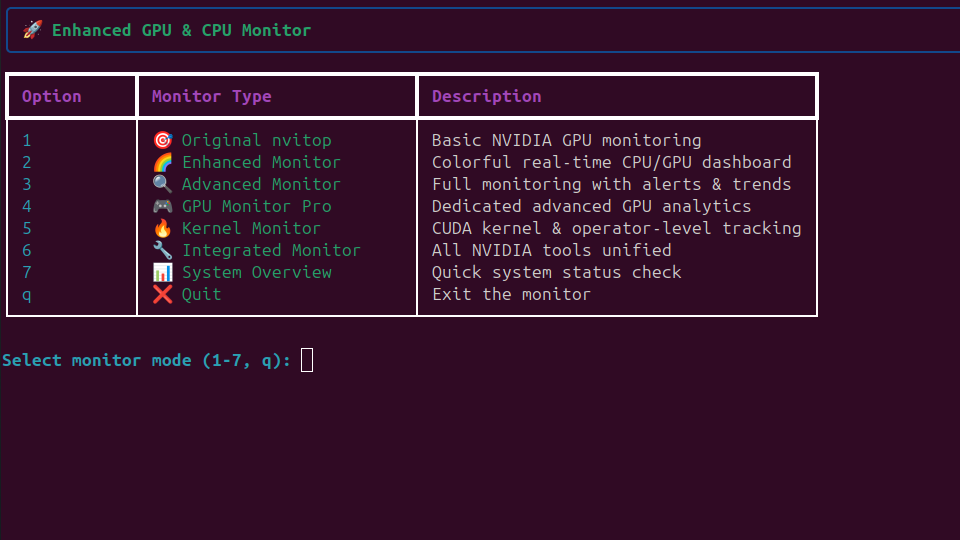
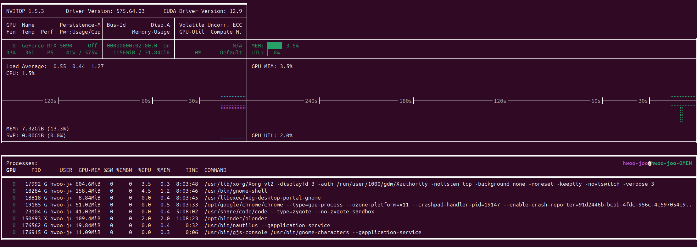
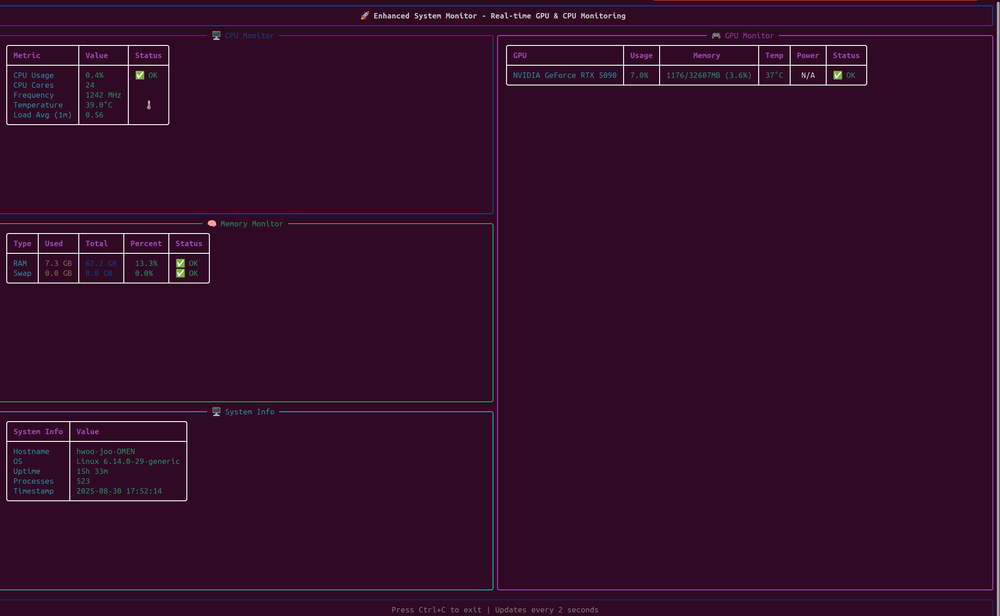
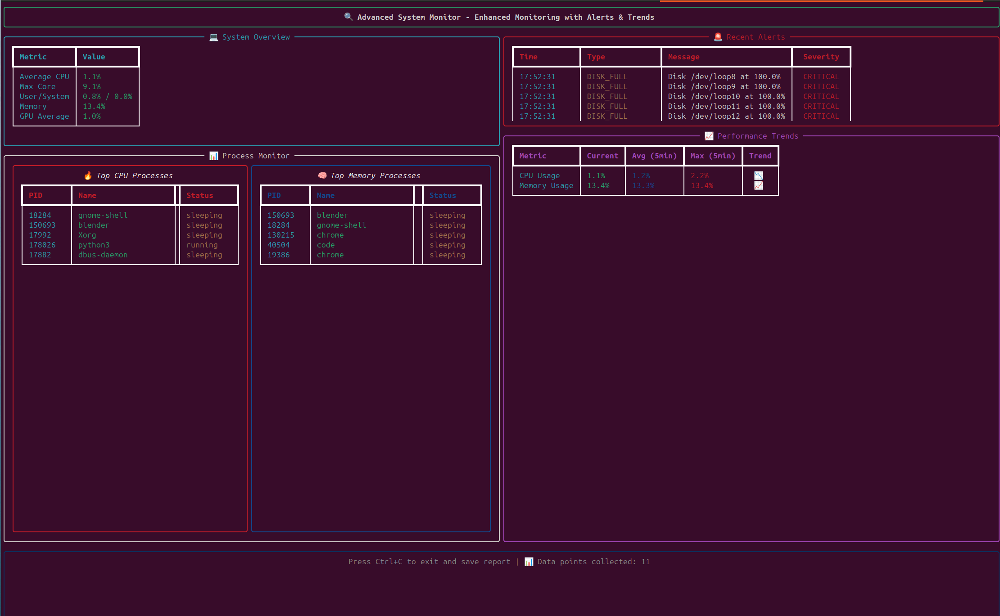
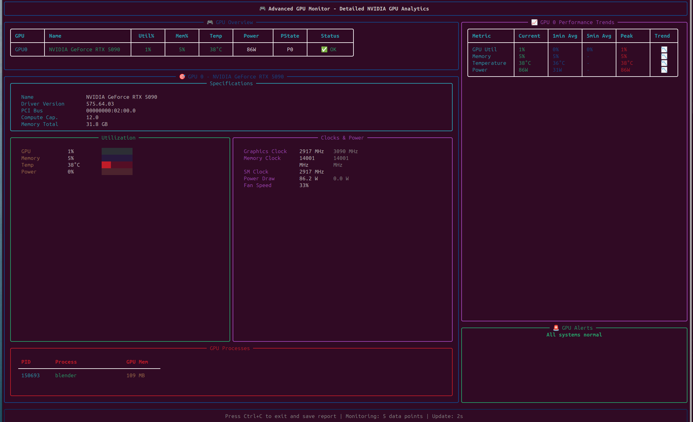
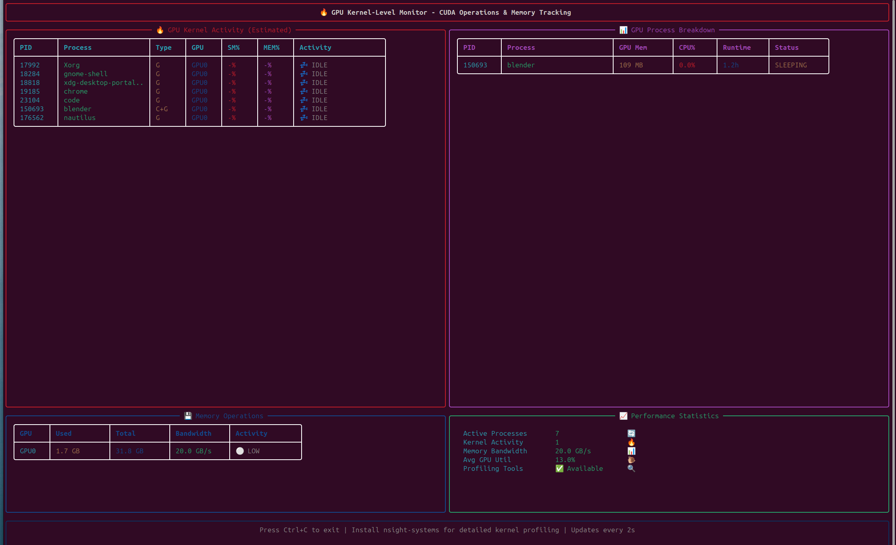
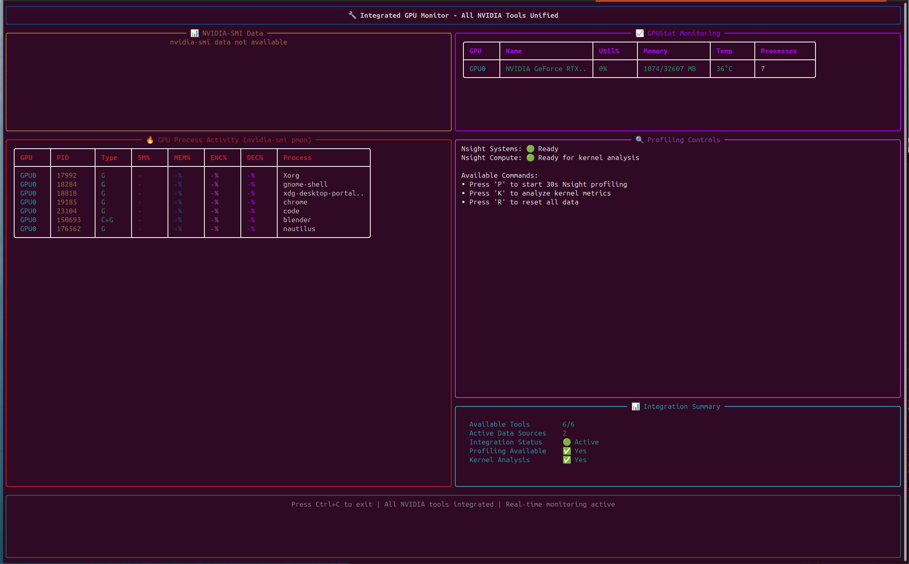
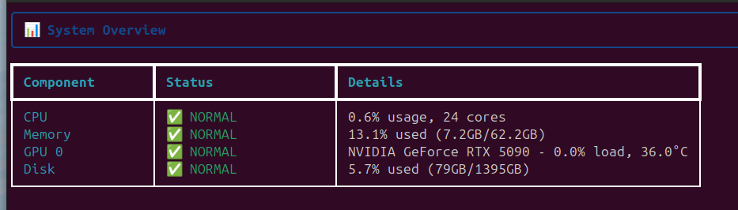

# 🚀 Enhanced GPU & CPU Monitor

A professional-grade GPU monitoring suite with complete NVIDIA tools integration, providing real-time analytics, kernel-level tracking, and advanced profiling capabilities for RTX GPUs.



*Interactive menu showing all 7 monitoring options with beautiful Rich console interface*

## ✨ Key Features

### 🔧 Complete NVIDIA Tools Integration
- **✅ nvidia-smi** - Process monitoring and GPU metrics
- **✅ nsight-sys** - Kernel execution timeline profiling  
- **✅ ncu** - Detailed kernel performance analysis
- **✅ nvitop** - Interactive GPU monitoring (v1.5.3)
- **✅ gpustat** - Lightweight status monitoring 
- **✅ NVML** - Direct NVIDIA Management Library access

### 🎮 Professional GPU Analytics
- **RTX 5090 Optimized** - Perfect for latest NVIDIA GPUs
- **Multi-GPU Support** - Individual monitoring for each GPU
- **Kernel-Level Tracking** - CUDA operator and memory operations
- **Real-time Profiling** - Background nsight-sys integration
- **Power Efficiency** - Detailed power draw and thermal monitoring
- **Process Breakdown** - Per-process GPU resource usage

### 🌈 Beautiful Rich Console Interfaces
- **7 Different Monitors** - From basic to professional-grade
- **Color-coded Status** - Instant visual feedback (🔥 HIGH, ⚠️ MEDIUM, ✅ NORMAL)
- **Real-time Updates** - Smooth 2-second refresh rates
- **Interactive Menus** - Easy navigation with emoji indicators

## Installation

The project is configured with modern Python (3.11+) and includes all necessary dependencies:

```bash
# Dependencies are automatically managed with uv
uv sync
```

## Usage

### Interactive Menu
Run the main launcher for an interactive menu:
```bash
uv run python monitor.py
```

### Direct Mode Selection
Run specific monitors directly:

```bash
# Enhanced colorful monitor
uv run python monitor.py enhanced

# Advanced monitor with alerts
uv run python monitor.py advanced

# GPU Monitor Pro (detailed GPU analytics)
uv run python monitor.py gpu

# Kernel Monitor (CUDA operator tracking)
uv run python monitor.py kernel

# Integrated Monitor (all NVIDIA tools unified)
uv run python monitor.py integrated

# System overview (quick status check)
uv run python monitor.py overview

# Original nvitop
uv run python monitor.py nvitop
```

### Individual Scripts
You can also run the monitors directly:

```bash
# Enhanced monitor
uv run python enhanced_monitor.py

# Advanced monitor with alerts
uv run python advanced_monitor.py

# GPU Monitor Pro
uv run python gpu_monitor_advanced.py

# Original nvitop
uv run nvitop
```

## 📊 Monitor Types & Screenshots

### 1. 🎯 Original nvitop - Basic NVIDIA GPU monitoring

*Original nvitop interface showing RTX 5090 with GPU utilization, memory usage, temperature, and running processes*

### 2. 🌈 Enhanced Monitor - Colorful real-time CPU/GPU dashboard

*Beautiful Rich console interface with CPU, Memory, GPU, and System panels with color-coded status indicators*

### 3. 🔍 Advanced Monitor - Full monitoring with alerts & trends

*Comprehensive monitoring with system overview, alerts (showing CRITICAL disk alerts), performance trends, and top processes*

### 4. 🎮 GPU Monitor Pro - Dedicated advanced GPU analytics

*Professional GPU analytics with detailed RTX 5090 specifications, utilization bars, clock speeds, power consumption, and performance trends*

### 5. 🔥 Kernel Monitor - CUDA kernel & operator-level tracking

*Advanced kernel-level monitoring showing CUDA operations, process breakdown, memory operations, and performance statistics*

### 6. 🔧 Integrated Monitor - All NVIDIA tools unified

*Unified interface combining nvidia-smi, gpustat, nsight-sys, and ncu with profiling controls and integration status*

### 7. 📊 System Overview - Quick system status check

*Clean system summary showing all components (CPU, Memory, GPU, Disk) with NORMAL status for RTX 5090 system*

## Alert Thresholds (Advanced Monitor)

Default alert thresholds can be customized in `advanced_monitor.py`:

```python
alert_thresholds = {
    'cpu_percent': 85.0,        # CPU usage percentage
    'memory_percent': 90.0,     # Memory usage percentage
    'gpu_percent': 90.0,        # GPU usage percentage
    'gpu_memory_percent': 95.0, # GPU memory percentage
    'gpu_temperature': 85.0,    # GPU temperature (°C)
    'disk_percent': 95.0        # Disk usage percentage
}
```

## Output Files

The advanced monitor generates several output files:
- `system_monitor.log`: Alert and system event log
- `performance_report.json`: Detailed performance statistics

## Key Features

### 🎨 Visual Features
- **Color-coded status indicators** (🔥 HIGH, ⚠️ MEDIUM, ✅ NORMAL)
- **Rich console output** with tables, panels, and progress bars
- **Real-time updates** with smooth refresh
- **Emoji indicators** for quick status recognition

### 📊 Monitoring Capabilities
- **Multi-GPU support** with individual GPU tracking
- **Per-core CPU monitoring** with detailed metrics
- **Memory usage tracking** including swap
- **Process monitoring** with top CPU/memory consumers
- **Temperature monitoring** for CPU and GPU
- **Power consumption tracking** (when available)

### 🚨 Alert System
- **Configurable thresholds** for all monitored components
- **Real-time alerts** with severity levels (WARNING, CRITICAL)
- **Persistent logging** with timestamps
- **Historical alert tracking**

### 📈 Performance Analysis
- **Trend analysis** with visual indicators
- **Historical data collection** with configurable retention
- **Performance reports** in JSON format
- **Statistical analysis** (average, max, min values)

## Requirements

- **Python 3.11+** (configured in pyproject.toml)
- **NVIDIA GPU** with drivers installed
- **Modern terminal** with color support
- **Unix-like system** (Linux, macOS)

## Dependencies

All dependencies are managed automatically with uv:
- `nvitop>=1.3.0` - Base NVIDIA monitoring
- `rich>=14.1.0` - Rich console output
- `psutil>=7.0.0` - System information
- `GPUtil>=1.4.0` - GPU utilities
- `numpy>=2.3.2` - Numerical operations
- `pandas>=2.3.2` - Data analysis
- `matplotlib>=3.10.6` - Plotting capabilities
- `seaborn>=0.13.2` - Statistical visualization

## Tips

1. **Use Enhanced Monitor** for daily monitoring with beautiful visuals
2. **Use Advanced Monitor** when you need alerts and historical tracking
3. **Run in tmux/screen** for persistent monitoring sessions
4. **Check performance reports** for long-term analysis
5. **Customize alert thresholds** based on your system's normal operation

## Troubleshooting

- **No GPUs detected**: Ensure NVIDIA drivers are installed
- **Permission errors**: Some system sensors may require elevated privileges
- **High CPU usage**: The monitors use minimal resources, but reduce update frequency if needed
- **Terminal compatibility**: Use a modern terminal with color and Unicode support

---

**Enjoy powerful, colorful, and insightful monitoring of your GPU and CPU systems!** 🚀